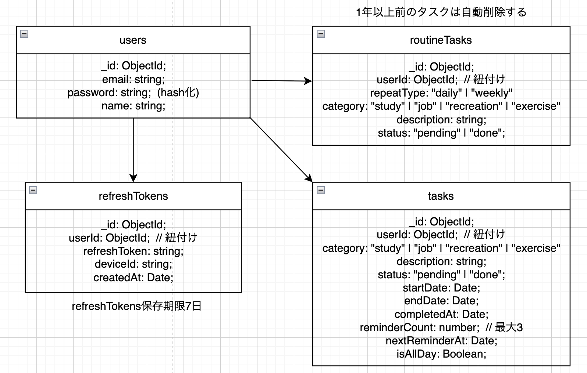

### はじめに
- 本アプリは利用者の予定や実行したタスクをわかりやすい形で記録するためのタスク管理アプリです。
- 「勉強」カテゴリーに属しているタスクに関しては、完了してから一定日数経過後、リマインダーメールが複数回に渡って送信され、復習を促してくれます。

### URL
https://task-control-app-46ty.onrender.com/auth

### テスト用アカウント
- Email: test@example.com
- Password: testpassword

### 制作した背景
- 一度学習したものを復習せずに放置し、後日振り返ったら何も覚えていない経験が何度もありました。最初は強した日にそれをexcelに記入し、毎日excelを確認しようとしたが、毎日excelを開くことを習慣化できませんでした...　そこでこのリマインダー付きタスク管理アプリを作成しました。

### 機能概要
- ログイン、ログアウト、サインアップ
- ダーク・ライトモード切り替え
- 本日のタスク、ルーティン表示および全てのタスクをカレンダー上で表示する
- 未完了のタスクのみ表示する
- タスク、ルーティン新規作成、およびバリデーション機能
- タスク、ルーティン編集、削除
- 毎日0時に日ごとルーティン完了状態更新、毎週月曜日0時に週ごとルーティン完了状態更新
- 学習した内容に関するリマインダーメール送信(1日後、7日後、14日後)
- タスク保存期間1年
- レスポンシブ対応
- トークンおよびリフレッシュトークンによる認証

### デモ動画
<video width="320" height="240" controls>
  <source src="./image/video.mov" type="video/mp4">
</video>

### リマインダーメール

### 環境
- フロントエンド： HTML, CSS, TypeScript, React
- バックエンド： TypeScript, Express
- データベース： MongoDB
- デプロイ： Render
- その他： Docker

### データベース設計

### 実装予定の機能
- パスワード変更機能
- パスワードを忘れた際の認証方法
- Googleアカウントなどによるログイン
- リマインダー機能オンオフ切り替え

### 工夫したポイント
- アクセストークンを短期間で失効するように設定し、長期間のリフレッシュトークンを利用することでセキュリティ向上と利便性の両方を実現。
- わかりやすいかつモダンな見た目のUI、およびアニメーションを実装。

