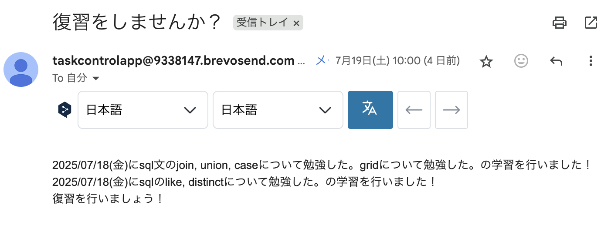

### 📌はじめに
- このアプリは、利用者の予定や実行済みタスクを視覚的に管理できるタスク管理アプリです。
- 特に「勉強」カテゴリーのタスクについては、完了後に一定期間が経過すると複数回にわたってリマインダーメールが送信され、継続的な復習を促します。

### 🔗URL
https://task-control-app-46ty.onrender.com/auth

### 🔑テスト用アカウント
- Email: test@example.com
- Password: testpassword

### 💡制作背景
- 一度学んだ内容を復習せず放置してしまい、時間が経つと何も思い出せない…そんな経験が何度もありました。当初は学習日をExcelに記録し、毎日見返すことで対処しようとしましたが、Excelを開く習慣が続かず失敗。そこで、学習記録を簡単に残せて、復習のタイミングを自動で通知してくれるリマインダー付きのタスク管理アプリを作成しました。

### 🔧機能概要
- ユーザ認証(ログイン、ログアウト、サインアップ)
- ダークモード/ライトモード切り替え
- 本日のタスクとルーティン、すべてのタスクをカレンダー表示
- 未完了タスクの絞り込み表示
- タスク・ルーティン新規作成とバリデーション
- タスク・ルーティンの編集・削除
- 毎日0時に日次ルーティンの状態を自動更新、毎週月曜0時に週次ルーティンの状態を自動更新
- 「勉強」タスク完了後、1日後・7日後・14日後にリマインダーメールを送信
- タスク保存期間：1年間
- レスポンシブ対応
- アクセストークン＋リフレッシュトークンによる認証方式

### 🎥デモ動画
##### ダークモード

##### タスク編集

##### タスク一覧

##### タスク作成

##### リマインダーメール例

### 🧱使用技術
- フロントエンド： HTML, CSS, TypeScript, React
- バックエンド： TypeScript, Express
- データベース： MongoDB
- デプロイ： Render
- その他： Docker

### 🗂データベース設計

### 🛠実装予定の機能
- パスワード変更機能
- パスワードを忘れた際の再認証機能
- Googleアカウントなどによる外部ログイン機能
- リマインダー機能のオン/オフ切り替え

### 💡工夫したポイント
- 短期間で失効するアクセストークンと長期間有効なリフレッシュトークンを組み合わせ、セキュリティと利便性の両立を実現。
- 直感的でモダンなUIデザインとアニメーションにより、操作性とユーザー体験を向上。

